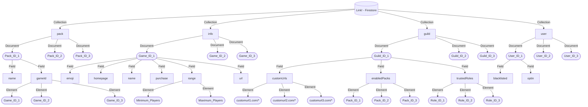

<h1 align="center">
   
  
   
  Link!
   
</h1>

<h4 align="center">Securely send gamelinks to people present in the voice channel!</h4>

  
  
  <a href="https://github.com/aumanshkaushal/link">
  

## Firestore Flowchart:

